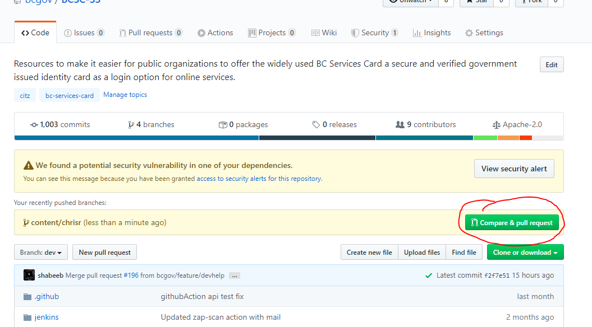
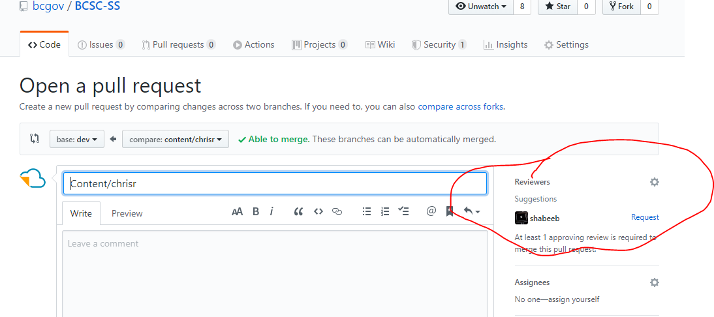
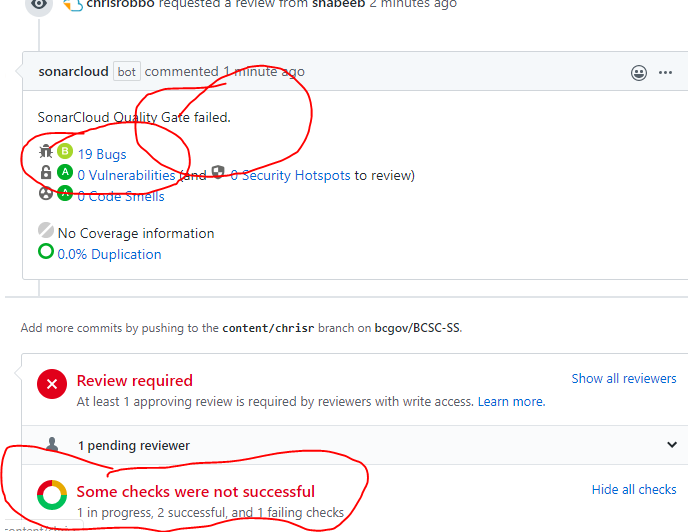
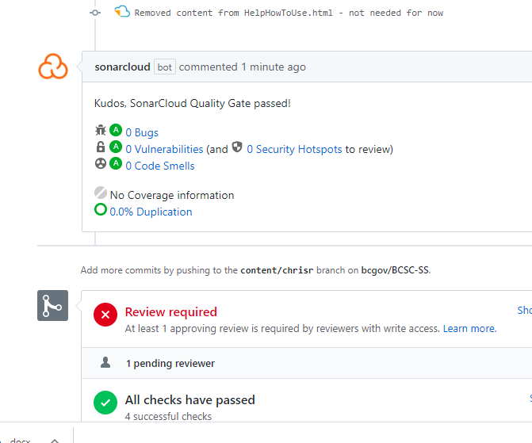

# About this folder
This folder is used to provide help pages as pure html for non-technical users to edit.

## Rules 
If you have not yet cloned the project BCSC-SS do so with (using git bash)

``` git clone https://github.com/bcgov/BCSC-SS.git ```


Checkout the github project onto a local branch, by convention we will use the branch name

``` content/\<username> ```

 where \<username> is your name, say chrisr ```


If using git bash you will type

```git pull origin dev -b content/<username>```

Navigate to this folder ( **selfservice-ui/src/html**  ). 

### Editing html
You can edit any html file , I suggest using Visual Studio code with the html preview plugin so you can see your changes live as you edit . Use one of the existing files as a template, note the header section which must be there else the online code analyser will barf .
``` html
<!DOCTYPE html>
<html lang="en">
  <head>
    <title>Help page</title>
    <style lang="scss">
      @import './../assets/styles/theme.scss';
    </style>
```
Some other points to watch - the code analyser looks for accessibility stuff too, for example tables need to have "aria-describedby" in the "\<table>"  tag plus each \<th> tag needs scope="col" 

eg.
``` html
<table aria-describedby="Comparison between dev and prod" >
      <tbody><tr><th  scope="col"><p /></th>
```
### Adding images

Images must be copied into the folder **selfservice-ui/public/help-img**, and refereced in your html with reference "../../public/help-img/\<image-name> "

### Adding a new help page

If you want to add a completely new help page , you also need to edit 3 places in the Help.vue file, if you look in it it is pretty self-explanatory - in the below snippet you will see how file HelpGoLive.html is added as a page accessible at  "/help/help-go-live" - this can then be used in a href in any parent page 

``` html

<template>
  <div>
...
    <div v-html="helpGoLive" v-if="page === 'help-go-live'" />
  </div>
</template>
<script lang="ts">
    ...
const helpGoLive = require('./HelpGoLive.html');
...
  public helpGoLive: any = helpGoLive;
}
</script>
```

Once you have finished editing your html file, and added any required entries to the Help.vue file you can check in your code with 

``` git add <filename> ```

```git commit <filename> -m"brief description of what I changed" ```

```git push localhost content/<username>  ```

Then you will login to github https://github.com/bcgov/BCSC-SS and create a pull request for your changes. 




Assign a reviewer




Check that the changes do not  break the pre processing




  - if so make changes locally  , commit and push again. Many of the problems arise from minor accessibility issues eg. alt attributes on images etc. You can click on the failed link in github and it will help you resolve the issues. 




 Your changes will be added to the current pull request. 


